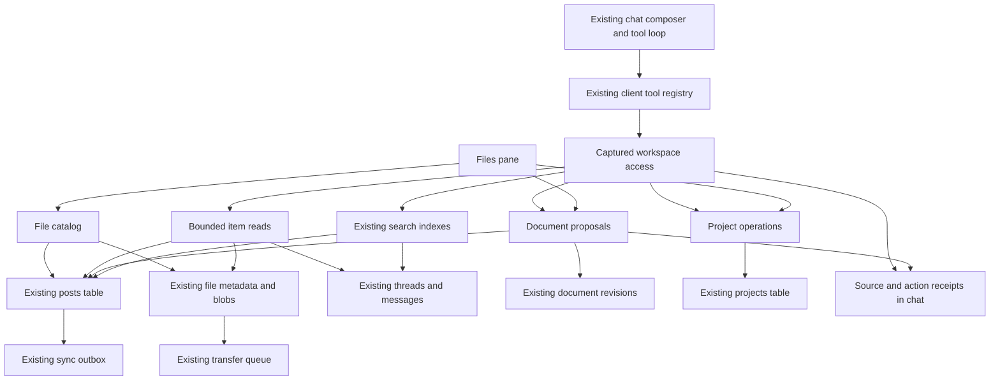

# Design

## Overview

Build five small workspace tools for the existing chat and one Files pane. Users continue asking questions normally, inspect linked sources, save new documents, and review changes to existing documents. Files provides browsing and reuse; existing projects provide grouping.

Deliver in three usable increments:

1. **Find and read:** workspace search/read with source receipts in normal chat.
2. **Create and update:** native document creation, reviewable edits, and project organization.
3. **Save and reuse files:** Files, upload/catalog ownership, simple text search, preview, and safe Trash.

The requirements cover all three increments. Each increment must meet its applicable UX and access requirements before exposure. Do not make the first two wait for a complete file-management product.

## Architecture



Components are narrow responsibilities, not new frameworks:

| Component | Responsibility and implementation home | Requirements |
|---|---|---|
| C1 Workspace access | Capture and validate database/subject/generation/permission/cancellation for one operation; a small helper beside chat tools. | R1, R3, R12 |
| C2 Workspace search | Add a non-UI query operation to the existing palette search implementation and reuse its index host/lifecycle. | R2, R3, R11 |
| C3 Item reading | Read whitelisted core resource kinds with bounds, revision stamps, and source references. | R2, R3, R8, R12 |
| C4 Document changes | Reuse document persistence, schema, operation validation, hunks, and revision history for create/propose/apply. | R4, R5, R9 |
| C5 Project operations | Extend the existing project CRUD/entry normalization for file entries and scoped writes. | R6, R12 |
| C6 File catalog | Own file names, indexed excerpts, and logical library lifecycle using existing posts and blobs. | R7, R8, R9, R12 |
| C7 Text import | Decode bounded UTF-8 text during import; no parser service or model call. | R7, R8, R11 |
| C8 Files pane | Browse, search, preview, upload, organize, and recover saved material. | R7, R8, R9, R10 |
| C9 Chat receipts | Render verified sources and accurate pending/applied action states using the existing tool-call surface. | R1, R3, R4, R5, R6, R10 |
| C10 Tool registration | Register five client tools and their existing availability/enablement gates. | R1, R3, R4, R5, R6, R11, R12 |
| C11 Qualification | Own acceptance journeys, boundary coverage, documentation, and simplification review. | R10, R11, R12, R13 |

### Existing owners to extend

- `app/utils/chat/tool-registry.ts`, `types.ts`, and `app/composables/chat/useAi.ts`: context-bound tools and the current model loop.
- `app/core/search/command-palette/{coordinator,source-index,lifecycle,registry}.ts` and `sources/`: full-text indexes, fallback, invalidation, and navigation metadata. `useCommandPalette.ts` already owns a lazy coordinator.
- `app/db/documents.ts`: includes captured-database helpers such as `getDocumentInDb` and `updateDocumentInDb`.
- `app/utils/documents/document-ai-operations.ts`, `useDocumentAiAgent.ts`, and `DocumentEditorRoot.vue`: actual content schema, bounded operations, proposal validation, and editor integration.
- `app/db/document-revisions.ts` and `useDocumentEditorSessions.ts`: history and flushing active editors.
- `app/db/files.ts`, `app/core/storage/transfer-queue.ts`, `shared/files/`: binary storage, transfer, type classification, and current capability admission.
- `app/db/schema.ts`, `shared/sync/{schemas,types,sanitize}.ts`: existing persistence/wire boundaries.
- `app/composables/projects/useProjectsCrud.ts` and `app/utils/projects/normalizeProjectData.ts`: current project entries and CRUD.
- `app/composables/core/usePaneApps.ts`, sidebar registration, workspace tabs, and profiles: expose the Files pane through existing navigation.
- `app/components/chat/ToolCallIndicator.vue`: current tool progress/results. Extend its workspace-result presentation rather than add another activity timeline.

## Components and Interfaces

### C1: Capture authority once

Use host-created context, never a model-provided workspace ID:

```ts
type WorkspaceItemRef =
    | { kind: 'chat'; id: string }
    | { kind: 'document'; id: string }
    | { kind: 'project'; id: string }
    | { kind: 'file'; id: string }; // catalog post ID, not a storage URL

interface WorkspaceOperationScope {
    db: Or3DB;
    workspaceId: string;
    generation: number;
    subject: string | null;
    signal: AbortSignal;
    assertCurrent(access: 'read' | 'write'): void;
}
```

Resolve this from `ToolExecutionContext` plus the active workspace/session. Static mode uses the user's local workspace. Cloud mode checks the existing workspace role; server sync/storage authorization remains mandatory and authoritative. A client-side check is never described as a replacement for `can()` at the server boundary.

Check scope before reads, after asynchronous preparation/downloads, before returning content, and immediately before a transaction commits. Cancellation/workspace change prevents an operation from changing its database destination. Refactor only called helpers that currently re-read global `getDb()` after awaits to accept the captured database; do not sweep unrelated persistence code.

Keep the current workspace access model. Do not advertise access to other users' supposedly private chats if the product has no such per-item privacy boundary.

### C2: Reuse search without controlling the palette UI

Add a `searchOnce`-style operation to the existing search coordinator/index host. It accepts query, core source IDs, optional project ID, result limit, and captured scope. It must not call `setQuery()` on the visible palette, change its selected row, or navigate.

Reuse the lazy index host rather than warming another complete index on each tool call. If separating that host from `useCommandPalette` is necessary, extract only its current lifecycle ownership; retain the same index implementation and invalidation hooks.

Initially admit only `chat`, `document`, `project`, and the dedicated file source. Palette commands, settings, system prompts, internal revision posts, and plugin-private posts are not assistant search sources. Third-party palette registration does not imply permission to expose its content to a model.

Filter project membership and logical Trash before limiting results. Re-read candidate records before returning excerpts so a stale index cannot expose deleted/inaccessible material. Reuse document normalization; tighten chat normalization to the visible branch/history path, excluding reasoning, raw tools, and superseded replies. Fix that owner once for both search surfaces.

Limits are internal constants, not a settings page: 20 hits per search, approximately 300 characters per excerpt, and 16 KiB total serialized result per tool read/search, also subject to stricter existing host/model limits. Existing model context handling must budget cumulative results; use a 64 KiB workspace-result ceiling per turn unless the model permits less. Return explicit truncation/continuation metadata. Do not repeatedly dump the same long transcript into the request.

Lexical search is the first implementation. Tool descriptions teach the model to search a few concrete terms when a natural-language query misses. No automatic unbounded retry loop or semantic-search promise.

### C3: Bounded reads and actual source links

`workspace_read` takes a typed item reference and optional continuation. It returns title, source reference, revision, excerpt/blocks, and coverage. Read only a requested page of messages, document blocks, project entries, or supported file text.

For document reads, first settle any live editor through the session registry. If multiple live editors disagree, report that the document must be saved/reconciled; do not choose an arbitrary buffer. Return host-created block references using the existing document snapshot rules. A `readId` identifies the corresponding host tool receipt, revision, and blocks actually exposed to the model. A truncated block is readable context, not a writable block reference; if a single block exceeds the safe read bound, offer the existing editor's selection-edit path instead of replacing unseen content.

Build links with existing resource-opening/navigation functions. The model supplies item IDs to tools; it never supplies executable navigation actions or arbitrary storage URLs. Receipt links are revalidated when opened. A citation may identify a specific message/section when the existing resource navigator supports it; otherwise open the correct item and show the quoted excerpt rather than invent a deep link.

Uploaded images/PDFs are not automatically readable through a string-only tool result. In the first release, `workspace_read` returns their metadata and honest capability information. **Ask in chat** is an explicit UI handoff into the existing multimodal attachment path. Broad PDF/vision retrieval is a later, separately justified capability.

### C4: One document editing implementation

Expose two paths:

- **Create:** validate native TipTap content, create once, optionally associate with a project, then return a saved-document receipt. Validate node/link attributes and resolve referenced file hashes in the captured workspace as well as checking the content schema. Validate both targets before committing the requested document/project operation in one captured-database transaction.
- **Edit:** the current chat model produces existing `DocumentAiOperation` values against a prior `readId`. Validate them, stage a proposal, and return `pending_review`. Applying it is a host UI action.

Avoid nesting a second Document AI model call inside a chat tool. Tool execution has a bounded timeout; proposal preparation should be local work. Factor the content-schema/proposal preparation needed by chat out of the existing document editor/agent. The editor and chat must consume the same schema and validation, including enabled editor extensions. Do not create a reduced schema that silently drops custom nodes, a hidden second live editor, or a competing edit engine.

Reconstruct the frozen snapshot only if the document still matches the read receipt's revision/content digest. Operations may target only valid block references exposed by that read. Reuse the existing operation and output limits (currently 64 operations and 256 KiB) as maximums; stricter transport/context bounds still apply.

Persist a small proposal envelope in the originating message's existing `data`, beside tool-result metadata:

```ts
type DocumentChange =
    | { status: 'pending'; documentId: string; readId: string;
        baseRevision: string; operations: DocumentAiOperation[] }
    | { status: 'applied'; documentId: string; beforeRevisionId: string;
        afterRevision: string }
    | { status: 'discarded' | 'stale'; documentId: string };
```

Do not persist a second full document snapshot in every receipt. Retain the original read revision and proposal operations; create the pre-change snapshot through existing document history when applying. Store host-owned status separately from model-authored prose. A model response saying “saved” cannot mark a pending action applied.

Apply flow: capture/settle the live editor, verify ownership and revision, prepare the existing history checkpoint, re-check after preparation, and atomically save the document plus action receipt. Integrate the resulting document with mounted editor sessions so a delayed autosave cannot write the previous content back. Extend captured-database support into revision helpers where required. Failure leaves the original document and a recoverable proposal.

Use the existing tool execution identity (`requestId`/`callId`) for idempotent document creation and receipts. Guard Apply transactionally against duplicate clicks/replays. Undo verifies the applied revision is still current; otherwise **View history** preserves later changes.

These transaction/revision guarantees apply to the captured local database, including multiple tabs sharing it. Preserve current per-record LWW sync across devices. An offline device cannot know about an unreceived remote edit; do not claim global exactly-once writes or conflict-free collaboration. Retain local/cloud status separately, preserve history, and invalidate Undo/proposal controls when a newer remote winner arrives. No distributed lock or CRDT is introduced.

### C5: Projects remain collections

Extend `ProjectEntryKind` to include `file`, referencing a catalog post ID. Keep `projects.data` as the existing canonical membership list; do not add a parallel `project_id` for files or use cached entry names as identity. De-duplicate association changes by kind and ID.

Use a small discriminated operation for create, rename, set description, add item, and remove item. Non-create mutations carry the revision returned by project read. Resolve current rows inside a captured-database transaction; do not write an old complete project object over new memberships.

Reuse existing thread/project behavior instead of migrating every legacy chat association. For search filters, reconcile the supported existing thread pointer/list semantics in one project-membership reader. Preserve unknown entries when editing recognized memberships; do not coerce them into chats or discard them.

### C6/C7: Catalog records and small text imports

Keep original bytes in existing hash-addressed storage. Add a host-owned catalog post subtype, `or3:file`, rather than a new table/provider schema or treating `file_meta.deleted` as library visibility. It provides a stable title, text excerpt, and recoverable library state independently of shared blob availability.

Use a deterministic catalog ID derived from the canonical hash within the workspace. A duplicate upload reuses the entry. The catalog title is the user's current display name; `file_meta.name` remains original storage/attachment metadata. Never overwrite a user-renamed catalog title merely because the bytes were uploaded again.

At import, decode at most a 64 KiB UTF-8 prefix for supported text formats, retaining only complete characters. Reject binary/invalid encodings as text, not as stored files. Record `full`, `prefix`, or `none` coverage. No OCR, package parser, vector index, remote extraction, or model call runs during upload. The small excerpt uses the catalog post's existing `content` field so another device can search it after metadata sync without downloading all blobs.

Reading further text uses bounded slices of the original blob through the existing transfer path. Report download-pending/offline states within the existing tool timeout; do not increase the timeout or add a polling service. Do not render Markdown/CSV text as executable content.

Upload ingestion is one idempotent operation used by Files and accepted regular chat uploads. Keep existing image/PDF model transport; text uploads become file references consumed by the read path rather than being forced into an unsupported model attachment type. Apply the existing MIME/size policy before intake, and preserve server-side admission. Cancellation or catalog-save failure must never delete a hash that another item references.

Extend the existing mention/reference-chip path with catalog file IDs; do not add another attachment-selection dialog. **Ask in chat** inserts the selected reference or supported attachment and focuses the composer without sending a prompt automatically. A user can remove the chip before sending.

**Add existing uploads** pages through current live metadata and calls the same catalog operation, preserving hashes/names. Existing entries are skipped without restoring Trash or renaming them; explicit re-upload restoration is a separate user intent. It does not fetch blobs to build excerpts; unavailable text remains `none`. A supported unindexed text file's preview offers **Enable text search** to download/read the bounded prefix and save the excerpt through the same importer. This requires write access and exposes progress/retry; opening a preview alone never triggers a catalog write. A paused/failed import can be rerun safely. This is an explicit reuse action, not an automatic schema migration or a new background job.

### C8/C9: User experience contract

The Files view opens through the pane/sidebar registries and existing workspace tabs. It does not force a split or replace the current chat while a model is working. Use **Files** as the label; **Library** already means the plugin library in OR3.

```text
Files                                   [Upload] [New document]
[ Search files…                    ] [All projects ▾] [All types ▾]

Name                           Project                 Modified
Proposal                       Acme                    Today     ⋯
Meeting notes.md               Acme                    Yesterday ⋯
Brand guide.pdf                Acme                    Tuesday   ⋯
```

Default sort is recently modified. Initial page: 50 rows, using existing pagination conventions. Native documents and catalog uploads share the list, with a type icon and matching actions. Project filters use existing projects. Avoid a second sidebar tree, tabs for every file format, drag reordering, and a new bulk-edit interface.

Click the filename or press Enter to open the document/preview in the existing tab system. The row menu contains Rename, Add to project, Download where supported, and Move to Trash. For native documents use current supported export formats; do not label serialized TipTap JSON as a Word file. Source links, file preview, and manual browsing use the same opening function.

For supported text, preview plain text and offer **Ask in chat**. For images/PDFs, reuse current preview/attachment components. For other files, display name/type/size, Download, and a precise capability message. On mobile, preview occupies the current pane with an explicit back action; it never opens a tiny side-by-side editor. All actions remain reachable through visible controls.

| Situation | User-facing behavior |
|---|---|
| Empty Files | “Keep documents and uploads here.” Upload is primary; New document and Add existing uploads are secondary. |
| No matches | “No files match…” with Clear filters; keep the typed query. |
| Reading/indexing | Show loading activity; do not display “No results” prematurely. |
| Upload in progress | Show a row with filename and progress; only offer actions that are available. |
| Local save, cloud pending | “Saved on this device · Syncing.” A failed transfer exposes Retry. |
| Unsupported text extraction | “Searches filename only.” Saving/downloading still works. |
| Partial text | “Searches the first 64 KiB.” A read can retrieve further text on request. |
| Blob unavailable offline | Keep metadata visible; “Not available on this device” and Retry when online. |
| Read-only workspace | Browsing works; write actions explain their unavailability. |
| Trashed item already open | Show a read-only Trash banner with Restore; prevent autosave from reviving it. |
| Proposal pending | One change card: document title, short summary, Review, Apply changes, Discard. |
| Proposal stale | “This document changed.” Update proposal reads the latest content; no silent rebase. |
| Apply complete | “Updated [document].” Open and Undo become available after the durable write. |

Chat activity uses the existing collapsed tool indicator with labels such as **Searching workspace** and **Reading meeting notes**. Show at most three source chips inline, with **Show all** for more. Keep raw tool arguments/results inside the current expandable details. Source chips and action receipts are host-rendered from validated results, not parsed from arbitrary model Markdown.

Changes requiring review use one card and the existing diff UI. Do not introduce an approval modal per read, per file, or per edited block. The review button opens the existing document review surface only when selected. For new documents, the saved result opens on click; it does not steal focus.

Use Nuxt UI controls, existing icons/theme overrides, visible keyboard focus, proper labels, status announcements, and reduced-motion behavior. Preserve the current chat draft and focus when closing previews or returning from a document. At narrow widths, collapse secondary metadata and put secondary actions in an accessible menu; keep filenames, status, and primary actions visible.

### C10: Five tools, registered normally

| Tool | Inputs | Result and effect |
|---|---|---|
| `workspace_search` | query; optional kinds/project; limit clamped to 20 | Bounded matches and coverage; read-only. |
| `workspace_read` | item reference; optional continuation | Bounded content, source, revision, read ID; read-only. |
| `workspace_create_document` | title; validated native content; optional project | Saved document receipt; idempotent for the execution. |
| `workspace_propose_document_edit` | document ID; read ID; existing edit operations | Validated pending proposal; no content mutation. |
| `workspace_update_project` | discriminated project operation; revision when updating | Saved project/association receipt. |

Register these as `runtime: 'client'`, using existing enablement, schema validation, availability checks, execution identity, cancellation, and result-size limits. Keep the group understandable in existing chat settings; do not require setup of five independent switches for the default experience. Honor existing explicit disablement and model tool support.

No raw SQL, arbitrary filesystem paths, workspace IDs, permanent deletion, generic shell tools, arbitrary URL fetching, or blanket plugin capability access is added. Extensions can register their own tools/search sources/panes through the established contracts. Add no generic resource adapter registry or format-plugin SDK in advance of a concrete second implementation.

## Data Models

No new Dexie table is required for the catalog or proposals.

| Existing storage | Use |
|---|---|
| `posts`, `postType: 'doc'` | Native documents, unchanged content format. |
| `posts`, proposed `postType: 'or3:file'` | Catalog title, bounded searchable text in `content`, one original hash in `file_hashes`. |
| `posts.meta` | One namespaced `or3.workspace-item` metadata value for logical Trash; file entries additionally record indexed-byte count and coverage. Preserve unrelated metadata. |
| `file_meta` / `file_blobs` | Existing immutable binary storage and provider identifiers. |
| `projects.data` | Existing entry list, extended with `kind: 'file'`. |
| `messages.data` | Validated source/action receipts and bounded pending proposal metadata. |
| Existing document revision posts | Before-edit checkpoint and Undo/history support. |

```ts
interface WorkspaceItemMetadata {
    version: 1;
    trashed_at: number | null;
    text?: { coverage: 'full' | 'prefix' | 'none'; indexed_bytes: number };
}

interface FileCatalogPost {
    id: string;                    // derived from canonical hash, workspace-scoped
    postType: 'or3:file';
    title: string;
    content: string;               // bounded plain-text excerpt, possibly empty
    file_hashes: string;           // existing serialized array: exactly one hash
    // Remaining Post fields and clock/HLC semantics are unchanged.
}
```

Use the existing `postType` index and existing file primary key. Start with current pagination/filter patterns. Do not add a compound index until the populated-library check demonstrates that a concrete query needs it. Catalog text is a deliberate, bounded materialization: it prevents a new device or search keystroke from downloading all original files. It is derived only from the immutable referenced bytes and must be discarded/rebuilt if that reference ever changes.

### Logical Trash versus binary deletion

`trashed_at` controls library visibility for both documents and catalog entries. Keep their post rows live (`deleted: false`) and retain `file_hashes` while recoverable; the existing sync bridge treats `deleted: true` as a deletion/tombstone, which cannot safely stand in for cloud-restorable Trash. Missing workspace-item metadata means visible, preserving current native documents.

Use one metadata visibility helper in Files, document/sidebar listings, mentions, project displays, and core search/read. Do not reinterpret plugin-private/revision posts as library items. Route relevant existing user-facing document-delete actions through the same Trash behavior to avoid contradictory views.

Permanently removing a catalog entry removes its ownership record through the existing post-delete path. It does not call object-storage delete directly. Native-document removal follows existing document/history retention, with its effect explained in the UI. Keep project associations while recoverable; prune them only for permanent removal.

Both SQLite canonical reference queries and Convex storage GC already inspect `posts.file_hashes` across post types. Verify this contract against the actual published provider versions. Retained catalog and Trash rows therefore protect original bytes using existing references. Do not manually inflate or sync `ref_count`; it is a derived local cache, not deletion authority. Protect shared deletion entry points, including the image gallery, using canonical live references and a final pre-delete check.

### Sync admission

The current project normalizer coerces unknown kinds to `chat`; an older writer could corrupt a new file association. Extend the existing small feature-capability admission pattern for workspace-item semantics, including catalog records, file memberships, and logical Trash. Reject incompatible read batches before application and incompatible writes before mutation. For writes, inspect both the incoming payload and the existing canonical record so omission by an older writer cannot erase new metadata/memberships.

This is a version marker and rejection path, not a second data format, legacy adapter, or generic negotiation service. Cover gateway and supported direct-provider paths. Deploy provider support before exposing new file/catalog writes in cloud, following the repository's package-release rules. Do not assume that editing a sibling provider's source updates the published dependency consumed by OR3.

## Error Handling

Follow the existing `ok` discriminated-result style for bounded service results and existing `err`/`reportError` at UI/persistence boundaries. Do not introduce an application-wide error framework.

| Failure | Outcome and recovery |
|---|---|
| Invalid arguments or unsupported operations | Reject before work through current tool schema validation. |
| Empty search/no match | Return a successful empty result with actual coverage; user/model can refine terms. |
| Partial index or failed source | Return available sources and an explicit partial flag; retry only the failed source. |
| Wrong workspace, lost permission, cancellation | Abort the scoped operation; discard late content and keep any earlier committed receipt in its original workspace. |
| Target missing/trashed | Return unavailable; do not guess another target or read stale cached content. |
| Tool read requires unavailable blob | Return offline/download-pending with a bounded retry path. |
| Invalid document content/custom-node mismatch | Preserve original document; identify unsupported content and offer regeneration/manual editing. |
| Revision changed during apply/checkpoint encoding | Mark stale; no overwrite. |
| Quota or local transaction failure | Keep original state, preserve the user's draft, and expose Retry. |
| Cloud transfer/sync refusal | Keep successful local content and display local-only/pending/error status accurately. |
| Text decode failure | Keep original file and metadata; filename search/Download still work. |
| Old client/provider | Return the current upgrade-required error pattern; do not partially admit new record semantics. |
| Partial batch import | Report per-file outcome and retain successful entries; retry is idempotent. |
| Delete races with a new reference | Canonical re-check preserves the blob; report that it is still in use. |

## Testing Strategy

Planning performs no test execution or test changes. During implementation, enumerate credible failures and author needed acceptance/boundary coverage before the corresponding production changes, following `test-audit`. Prefer extending canonical suites over duplicating them.

**E2E primary owners:** extend `tests/e2e/production-chat-journey.spec.ts` and `production-document-journey.spec.ts` for real chat/editor flows; extend `storage-layer.spec.ts` for queue/durability contracts; use the existing production journey composition for the Files pane and actual navigation. Mock only the paid model transport with scripted tool calls; execute real tools, schema validation, database, rendering, and persistence. Do not add a production API or export solely to satisfy a test.

| Journey | Required observation | Requirements |
|---|---|---|
| Ask about a prior decision | Real search/read yields the seeded message; source opens the correct conversation; unrelated/private/trashed content absent. | R1, R2, R3 |
| Create a proposal document | One saved document survives reload; retry has no duplicate; requested project includes it. | R4, R6 |
| Revise that document | Preview does not save; Apply persists; Undo restores; user edit after proposal produces stale state. | R5 |
| Upload and reuse text | File appears once, indexed phrase is found, source opens it, deleting the originating chat retains bytes. | R7, R8 |
| Unsupported/large file | Stored bytes remain downloadable; filename-only/prefix status matches actual search coverage. | R8 |
| Trash and restore | No search/mention hit while trashed; original attachment still works; restore keeps identity; permanent catalog removal does not delete referenced bytes. | R9 |
| Project and workspace changes | Project updates preserve newer observed entries; switch/logout during read/apply never leaks or writes to destination workspace. | R3, R6, R12 |
| Mobile and keyboard | Files, preview, source opening, and edit review work at 320/390 px, keyboard-only, and 200% zoom. | R10 |
| Reload/offline/background | Pending proposals revalidate; completed work persists; client-tool unavailability is truthful; upload retry retains progress. | R5, R7, R12 |

**Boundary coverage:** add cases to existing canonical storage/sync and document lifecycle suites for catalog/Trash reference edges, unknown project-kind preservation, old-writer omission, authorization failure, late workspace results, replayed writes, stale apply, and permission changes. Use real Dexie transactions and actual provider adapters where those are the contract. Client-only browser tests do not prove server authorization or provider GC.

**Unit coverage:** no new test layer by default. A deterministic parsing/metadata rule may get a narrow pre-implementation test only if no stronger owner catches a distinct failure. No source-string, implementation-mirroring, or duplicate snapshot suites.

**Performance:** record the unchanged-chat startup baseline; run the current command-palette benchmark plus the bounded Files/search dataset from R11. Check warm search p95, initial row count, no bulk blob downloads, and absence of eager document/file modules on ordinary chat startup. Add no caching/concurrency infrastructure to meet a guessed workload; optimize only a demonstrated failing boundary.

**Repeatable artifacts:** each acceptance run retains its Playwright HTML report and trace, desktop/mobile screenshots, fixture identifiers, and a short receipt of created IDs, expected content markers, and original/downloaded file checksums. Artifacts must be produced from observed application state and use synthetic data. Record the command, commit, profile, and viewport so another developer can repeat it.

Use the current named commands as applicable, once per coherent batch/final gate: `bun run test:e2e:journeys`, `bun run test:e2e:command-palette`, `bun run test:e2e:storage`, focused canonical Vitest owner suites, `bun run type-check`, `bun run check:docs`, and `bun run command-palette:benchmarks:check`. Extend the existing named journey lane for new scenarios. Qualify server/provider cases in a disposable Basic Auth + SQLite + filesystem profile, and direct-provider contracts separately. Because this changes public tool/sync behavior and deletion safety, final implementation qualification includes all relevant security/storage/sync suites, typechecks, and a static-build smoke; broader release gates apply only if publishing is subsequently requested.

## Design Decisions

| Decision | Alternative considered | Reason |
|---|---|---|
| Five tools in the current loop | New workspace agent/orchestrator | Current tools already provide validation, cancellation, streaming, and browser execution. |
| Existing Orama plus fallback | Embeddings/vector database | Existing content search meets the first use case with no model/indexing service. |
| Reuse the search index host | Drive the visible palette or build a second search stack | Preserves UI state and one implementation of retrieval behavior. |
| Existing projects as collections | Nested filesystem hierarchy | Avoids two competing locations and new folder move/conflict semantics. |
| Catalog posts beside existing blobs | A new files table or direct `file_meta` library lifecycle | Posts already sync references; library names/Trash must not make shared attachment bytes unavailable. |
| Logical Trash in namespaced metadata | Reuse `deleted` or add a retention service | Existing `deleted` causes sync tombstones; retained live posts give restore and blob protection without a new job. |
| Small synced text excerpt | Parse/download every file on every device | Bounded duplication avoids bulk downloads and adds no cache database. Coverage is explicit. |
| Text formats first | OCR/PDF/Office parsing at launch | Useful retrieval without heavy dependencies or an unreliable universal-file claim. |
| Current chat model proposes validated operations | Invoke another document model inside the tool | Avoids nested latency, hidden extra spend, and the existing tool timeout. |
| One Apply step for existing docs | Silent edits or per-block permission dialogs | Reuses existing review semantics while keeping one clear commit point. |
| Browser tools in local and cloud | Duplicate server CRUD/retrieval APIs | One implementation preserves the local-first architecture; unattended execution stays explicitly unsupported. |
| Extend existing capability rejection | Translate older project/file representations | A concrete old-writer corruption risk needs a gate, not a compatibility subsystem. |

## Risks & Mitigations

1. **Library cleanup breaks shared attachments.** Keep logical visibility separate from blob availability, retain canonical post references while recoverable, guard every shared destructive entry point, and prove retention against real provider adapters before exposing Trash.
2. **Document edits race live editors or a workspace switch.** Reuse the editor sessions, captured-database helpers, revision checks, and document history; make receipts and saves atomic and test delayed autosave/cancellation explicitly.
3. **A search reuse refactor becomes a new framework.** Extract only a stateless query path/index-host ownership needed by two real callers. Keep source whitelisting and item reads concrete; reject speculative adapter registries and indexing services.
4. **File capability expectations exceed launch support.** Use explicit full/prefix/filename-only coverage and existing PDF/image handoffs. Treat conversion and binary editing as separate future work, not unchecked promises.
5. **Published providers or older clients silently discard new semantics.** Add narrowly scoped admission using the established feature-capability pattern, prove omission and mixed-version failure cases, and publish changed provider dependencies before enabling cloud writes.
