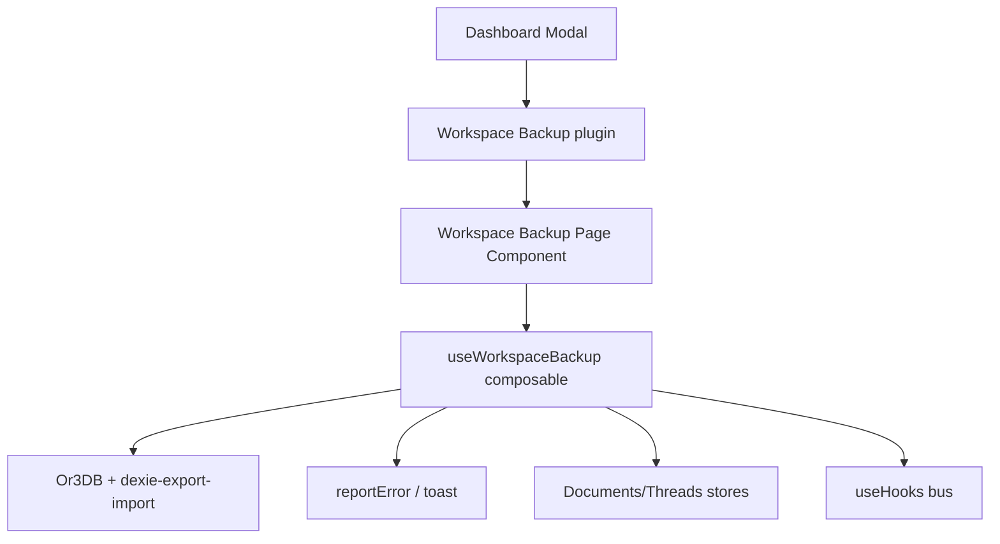

## Overview

Deliver a dedicated workspace backup page that lives inside the Dashboard modal as its own app tile and wraps Dexie’s `dexie-export-import` helpers to export/import the entire `or3-db`. The experience must be fast, frictionless, and resilient. The UI guides users through safe backups while keeping IndexedDB operations streaming to avoid memory spikes. The solution integrates with existing stores, error reporting, theming, and dashboard plugin conventions without introducing new tech debt.

## Architecture



-   **Dashboard modal** — Hosts tiles and pages; we add a dedicated “Workspace Backup” app tile with icon `pixelarticons:briefcase-upload`.
-   **Workspace page component** — Renders warnings, forms, progress indicators, file inputs, and consumes the composable.
-   **Composable** — Encapsulates export/import logic, validation, and progress state. Returns reactive state for the page.
-   **Dexie layer** — Uses existing `Or3DB` instance and the `dexie-export-import` add-on to stream backups.
-   **Stores & Hooks** — After import, emit cache invalidation events so composables reload live data.
-   **Error pipeline** — Use `reportError` + `err` helpers to display consistent error toasts.

## Components and Responsibilities

### `app/components/modal/dashboard/workspace/WorkspaceBackupApp.vue` (new)

-   Lazy-loaded Dashboard page registered under a dedicated Dashboard plugin tile (id `core:workspace-backup`).
-   Renders two primary cards (export/import) with shared guidance header, inline alerts, and aria-live status region.
-   Invokes `useWorkspaceBackup()` for all state, handles file input events, and triggers confirmation modal prior to destructive imports.
-   Uses existing UI primitives (`RetroGlassBtn`, `UAlert`, `UCard`) to match Dashboard aesthetics.

### `Dashboard.vue` updates (core tile registry)

-   Extend the `coreItems` definition with a new plugin entry:

    ```ts
    {
        id: 'core:workspace-backup',
        icon: 'pixelarticons:briefcase-upload',
        label: 'Workspace Backup',
        order: 45,
        pages: [
            {
                id: 'main',
                title: 'Workspace Backup',
                description: 'Export or restore your entire workspace.',
                component: () =>
                    import('~/components/modal/dashboard/workspace/WorkspaceBackupApp.vue'),
            },
        ],
    }
    ```

-   Ensure ordering keeps the tile grouped with other core utilities (after Images, before future additions).
-   Registration continues to flow through `registerDashboardPluginPage` during setup so Dashboard landing resolves the page.

### `app/components/modal/dashboard/workspace/WorkspaceBackupWarningModal.vue` (new, optional)

-   Encapsulates destructive confirmation UX with checkbox acknowledgement and mode summary.
-   Reusable for future destructive settings actions; emits confirm/cancel events consumed by the page component.

### `app/composables/useWorkspaceBackup.ts` (new)

-   Exposes `exportWorkspace`, `importWorkspace`, `peekBackup`, `reset`, and reactive state for progress, mode, errors, metadata, and warnings.
-   Wraps Dexie streaming helpers, normalizes progress (percentages, table counts), and throttles UI updates to avoid choppy reactivity in Dashboard modal.
-   Issues `hooks.emit('workspace:reloaded')` after successful import so dependent composables refresh.
-   Surface derived state like `ctaDisabledReason`, `progressLabel`, and `appendConflictSummary` to keep the component lean.

### `~/utils/workspace-backup.ts` (new helper)

-   Pure utilities for filename creation, progress conversion (`ImportProgress` → `{ percent, tableLabel }`), and Dexie meta validation logic (throwing typed errors consumed by composable).
-   Maintains separation of concerns so composable remains mostly orchestration and state management.

## Dashboard integration details

-   **Registration** — Add the tile to `coreItems` within `Dashboard.vue` with id `core:workspace-backup`, icon `pixelarticons:briefcase-upload`, and a single page referencing `WorkspaceBackupApp.vue`. The existing loop registers that page with the Dashboard registry automatically.

-   **Navigation** — Clicking the “Workspace Backup” tile opens the app directly (single-page plugin behavior), skipping any intermediate landing list.

-   **Lifecycle** — On unmount, the component calls `state.reset()` to clear progress and revoke object URLs, ensuring reopening the page starts from a clean slate.

-   **Error fallback** — If the dynamic `import()` fails, `Dashboard.vue` logs the error; we additionally surface a toast via `reportError(err('ERR_INTERNAL', ...))` and keep the user on the landing page.

## UI layout & state management

-   **Header** — Static description with inline link to documentation and a callout reminding users to export before importing.
-   **Export card** — Contains status badge (Idle, Exporting, Completed, Failed), `Export workspace` button, last export timestamp, and aria-live region describing progress.
-   **Import card** — Includes file input (drag/drop + browse), metadata preview (database name, version, table counts), import mode radio group (Replace vs Append) and overwrite toggle, plus CTA button disabled until acknowledgement modal is completed.
-   **Warning modal** — Summarizes consequences per mode, forces checkbox confirmation, and optionally requires typing “IMPORT” when replace mode selected for extra safety.
-   **Progress display** — Reuses `UProgress` with percent from composable; textual details show `completedTables/totalTables` and `completedRows/totalRows` when available.
-   **State machine** —

    ```text
    idle → peeking → confirm → importing → done
          ↘ validation-error → idle
          ↘ cancel → idle
    idle → exporting → done
          ↘ error → idle
    ```

    The composable exposes `currentStep` and derived booleans to drive button disable/enable logic and messaging.

-   **Accessibility** — aria-live polite regions announce state changes; modal traps focus and surfaces descriptive button labels (“Import and replace workspace”, “Import and append”).

## Interfaces (TypeScript)

```ts
export type WorkspaceImportMode = 'replace' | 'append';

export interface WorkspaceBackupState {
    isExporting: Ref<boolean>;
    isImporting: Ref<boolean>;
    progress: Ref<number>; // 0-100
    currentStep: Ref<
        | 'idle'
        | 'peeking'
        | 'confirm'
        | 'importing'
        | 'exporting'
        | 'done'
        | 'error'
    >;
    importMode: Ref<WorkspaceImportMode>;
    overwriteValues: Ref<boolean>;
    backupMeta: Ref<ImportMetadata | null>;
    error: Ref<AppError | null>;
}

export interface ImportMetadata {
    databaseName: string;
    databaseVersion: number;
    tables: Array<{ name: string; rowCount: number }>;
}

export interface WorkspaceBackupApi {
    state: WorkspaceBackupState;
    exportWorkspace(): Promise<void>;
    peekBackup(file: Blob): Promise<void>;
    importWorkspace(file: Blob): Promise<void>;
    reset(): void;
}

export function useWorkspaceBackup(): WorkspaceBackupApi {
    // implementation described in tasks
}
```

### Dexie integration helpers

```ts
import {
    exportDB,
    importDB,
    importInto,
    peakImportFile,
} from 'dexie-export-import';

interface ImportConfig {
    mode: WorkspaceImportMode;
    overwriteValues: boolean;
}

async function runImport(
    db: Or3DB,
    blob: Blob,
    cfg: ImportConfig,
    onProgress: (value: ImportProgress) => void
) {
    const baseOptions = {
        progressCallback: (progress: ImportProgress) => {
            onProgress(progress);
            return false; // continue
        },
    } satisfies ImportOptions;

    if (cfg.mode === 'replace') {
        await importDB(blob, { ...baseOptions, clearTablesBeforeImport: true });
        await db.open();
    } else {
        await importInto(db, blob, {
            ...baseOptions,
            clearTablesBeforeImport: false,
            overwriteValues: cfg.overwriteValues,
        });
    }
}
```

## Data Model & Persistence

-   Reuse existing `Or3DB` schema (`version 5`). Imports must confirm `databaseName === 'or3-db'` and `databaseVersion <= currentVersion`.
-   No new tables or migrations. The backup metadata is transient and kept in-memory only.
-   For append mode, rely on Dexie to merge data. The UI must clarify that duplicates may appear unless overwrite is enabled.

## Import/Export Workflow

1. **Export**

    - User opens Dashboard → clicks the “Workspace Backup” tile and clicks “Export workspace”.
    - `useWorkspaceBackup.exportWorkspace()` calls `exportDB(db, { numRowsPerChunk: DEFAULT_ROWS_PER_CHUNK })`.
    - Blob is turned into a downloadable file via `URL.createObjectURL` & hidden anchor click.
    - Progress indicator shows table/row counts; success toast confirms completion.

2. **Import**
    - User selects file from the Workspace Backup page → `peekBackup` reads metadata and validates schema.
    - Warning modal prompts confirmation and optional backup reminder.
    - On confirm, `importWorkspace` runs `runImport` with selected mode.
    - After success, close modal, emit `workspace:reloaded`, refresh stores (call `useDocumentsStore().refresh()` etc.).

## Error Handling & Safety

-   Wrap all Dexie operations in `dbTry` where possible to map quota errors to `ERR_DB_QUOTA_EXCEEDED`.
-   Use `reportError(err('ERR_DB_WRITE_FAILED', ...))` for import failures and `ERR_DB_READ_FAILED` for export read issues.
-   Cancel operations if `progressCallback` returns `true`; we keep it `false` but could wire a cancel token for future.
-   Validate metadata before import. If mismatched database name/version, show `ERR_VALIDATION` with actionable toast copy.
-   Clear `URL.revokeObjectURL` after download to avoid leaks.

## Accessibility & UX Notes

-   Buttons should have aria-live status text (e.g., "Exporting workspace: 40% complete").
-   Modal must trap focus with keyboard shortcuts for confirm/cancel.
-   Large buttons (RetroGlass style) to match design system; reuse `RetroGlassBtn` for consistency.

## Security & Privacy Considerations

-   Downloaded blobs stay on the user’s machine; no network calls are made.
-   Import process never uploads data; ensure `fetch` or remote interactions are avoided.
-   Warn users to store backups securely because they contain all workspace data.

## Testing Strategy

-   **Unit**

    -   Mock `dexie-export-import` to ensure `useWorkspaceBackup` sequences export and import calls and handles modes correctly.
    -   Validate metadata parsing and error paths (mismatched version, name).

-   **Integration (Vitest + happy DOM)**

    -   Mount the page component with mocked composable to assert UI states, modal flow, accessibility attributes.
    -   Verify store invalidation hooks fire on successful import.
    -   Mount `Dashboard.vue` with the updated `coreItems` to ensure the Workspace Backup entry appears, loads lazily, and recovers gracefully from dynamic import failures.

-   **E2E (Playwright or Cypress)**

    -   Simulate export triggering file save (stub `URL.createObjectURL`).
    -   Simulate import with Blob and confirm progress/warning interactions.

-   **Performance**

    -   Profile import/export with ~50k records to confirm UI remains responsive (<100ms main-thread blocks).

-   **Manual QA checklist**
    -   Export followed by immediate import (replace).
    -   Append mode without overwrite (verify duplicates) and with overwrite.
    -   Cancelling warning modal leaves workspace untouched.
    -   Corrupt file rejection.

## Open Questions / Follow-ups

-   Provide optional cancel capability mid-import/export? (Out of scope for initial release.)
-   Should filename include workspace identifier if multi-workspace support ships later? (Document for future.)
